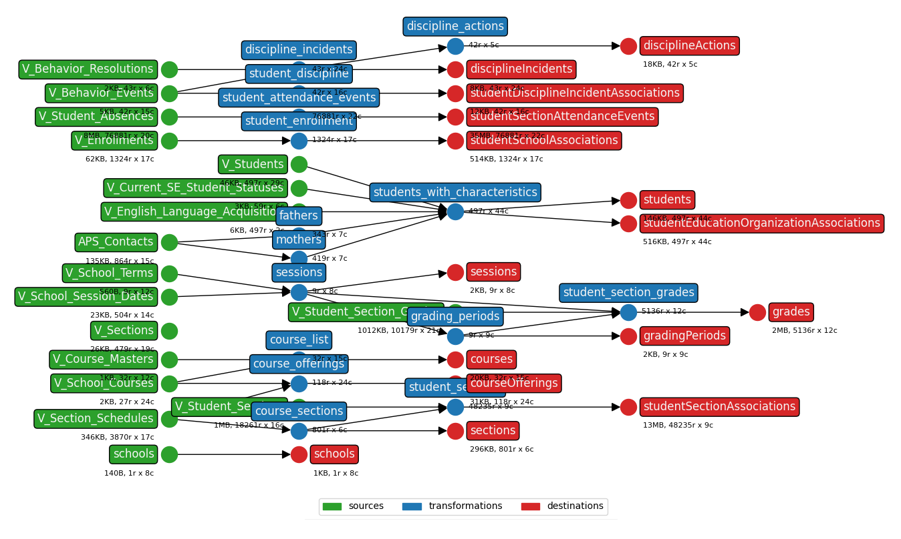
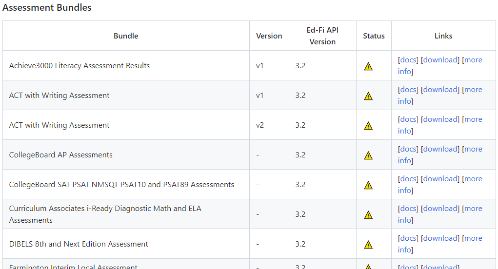

[comment]: # (controls: true)
[comment]: # (keyboard: true)
[comment]: # (markdown: { smartypants: true })
[comment]: # (hash: false)
[comment]: # (respondToHashChanges: false)


Data into Ed-Fi with<br /><code style="color:#007978;">earthmover</code> + <code style="color:#1c5ca7;">lightbeam</code>

<hr style="border-width:1px 0 0 0;" />

<div style="font-size:26px; line-height:56px;"><strong>Tom Reitz</strong> &nbsp; &nbsp; Data Engineer @ </div>


[comment]: # (!!! data-auto-animate)

### <code style="color:#007978;">earthmover</code>
* a Python CLI tool  <!-- .element: class="fragment" data-fragment-index="2" -->
* constructs Ed-Fi JSON from flat files based on a YAML configuration  <!-- .element: class="fragment" data-fragment-index="3" -->
* supports transformations like join, filter, distinct, group by, and more  <!-- .element: class="fragment" data-fragment-index="4" -->
* a JSON template is rendered for each row of transformed data  <!-- .element: class="fragment" data-fragment-index="5" -->


[comment]: # (!!! data-auto-animate)

### <code style="color:#FFF;">earthmover</code> configuration
```yaml  [|4-10|12-21|23-30]
config:
  output_dir: ./

sources:
  courses:
    file: ./data/Courses.csv
    header_rows: 1
  schools:
    file: ./data/Schools.csv
    header_rows: 1

transformations:
  courses:
    - operations: join
      sources:
        - $sources.courses
        - $sources.schools
      join_type: inner
      left_key: school_id
      right_key: school_id
    ...

destinations:
  # a destination for each Ed-Fi resource and descriptor
  schools.jsonl:
    source: $sources.schools
    template: ./json_templates/school.jsont
  courses.jsonl:
    source: $transformations.courses
    template: ./json_templates/course.jsont
```


[comment]: # (!!! data-auto-animate data-background-color="#007978")

### <code style="color:#FFF;">earthmover</code> template
```json [|2|18-20]
{
  "courseCode": "{{course_code}}",
  "identificationCodes": [
    {
      "courseIdentificationSystemDescriptor": "uri://ed-fi.org/CourseIdentificationSystemDescriptor#LEA course code",
      "identificationCode": "{{course_code}}"
    }
  ],
  "educationOrganizationReference": {
    "educationOrganizationId": {{district_id}}
  },
  "academicSubjectDescriptor": "uri://ed-fi.org/AcademicSubjectDescriptor#{{academic_subject}}",
  "courseDefinedByDescriptor": "uri://ed-fi.org/CourseDefinedByDescriptor#LEA",
  "courseDescription": "{{course_name}}",
  "courseGPAApplicabilityDescriptor": "uri://ed-fi.org/CourseGPAApplicabilityDescriptor#{{gpa_weight}}",
  "courseTitle": "{{course_name}}",
  "levelCharacteristics": [
    
    { ... }
    
  ],
  "numberOfParts": 1
  "offeredGradeLevels": [
    ...
  ]
}
```
<small>JSON + Jinja templating languge</small>


[comment]: # (!!! data-background-color="#007978")

### <code style="color:#1c5ca7;">lightbeam</code>
* also a Python CLI tool                            <!-- .element: class="fragment" data-fragment-index="2" -->
* processes JSONL files                             <!-- .element: class="fragment" data-fragment-index="3" -->
* validates JSON based on Ed-Fi API's Swagger docs  <!-- .element: class="fragment" data-fragment-index="4" -->
* sends JSON to an Ed-Fi API in dependency-order    <!-- .element: class="fragment" data-fragment-index="5" -->


[comment]: # (!!! data-auto-animate)

### <code style="color:#FFF;">lightbeam</code> configuration
```yaml  [|1|2-8|7-8|9-15]
data_dir: ./
edfi_api:
  base_url: https://api.schooldistrict.org/v5.3/api
  version: 3
  mode: year_specific
  year: 2021
  client_id: ${EDFI_API_CLIENT_ID}
  client_secret: ${${EDFI_API_CLIENT_SECRET}
connection:
  pool_size: 8
  timeout: 60
  num_retries: 10
  backoff_factor: 1.5
  retry_statuses: [429, 500, 502, 503, 504]
  verify_ssl: True
``` 
<!-- .element: class="fragment" data-fragment-index="2" -->


[comment]: # (!!! data-auto-animate data-background-color="#1c5ca7")

Putting it all together

```bash
earthmover run path/to/config.yaml
lightbeam validate+send path/to/config.yaml
```
<small>(requires external orchestration - CRON, Airflow, Dagster, etc.)</small>


[comment]: # (!!! data-auto-animate data-background-color="#cbdc3f")

### Features
* <code style="color:#007978;">earthmover</code> visualizes data lineage


[comment]: # (!!! data-auto-animate)

### Features
* selectors: process only some descriptors/resources
  ```bash
  earthmover run path/to/config.yaml -s courses,student*
  lightbeam send path/to/config.yaml -s courses,student*
  ```

[comment]: # (||| data-auto-animate)

### Features
* use environment variables or command-line parameters (which override env vars)
  ```bash
  earthmover run path/to/config.yaml -p '{\
  "BASE_DIR":"path/to/base/dir"\
  }'

  lightbeam send path/to/config.yaml -p '{\
  "CLIENT_ID":"populated",\
  "CLIENT_SECRET":"populatedSecret"\
  }'
  ```

[comment]: # (||| data-auto-animate)

### Features
* <code style="color:#007978;">earthmover</code> source data quality expectations
  ```yaml
  # earthmover
  sources:
    schools:
      file: ./data/Schools.csv
      header_rows: 1
      expect:
        - low_grade != ''
        - high_grade != ''
        - low_grade|int <= high_grade|int
  ```
  <small>(run fails if expectations not met)</small>

[comment]: # (||| data-auto-animate)

### Features
* <code style="color:#007978;">earthmover</code> state tracking: only re-process if source files change (based on file hash)
  ```yaml
  # earthmover
  config:
    state_file: ~/.earthmover.csv
  ```

[comment]: # (||| data-auto-animate)

### Features
* <code style="color:#1c5ca7;">lightbeam</code> state tracking: selectively resend payloads
  ```yaml
  # lightbeam
  state_dir: ~/.lighbeam/
  ```

  ```bash
  lightbeam send path/to/config.yaml --newer-than 2020-12-25T00:00:00
  ```

[comment]: # (||| data-auto-animate)

### Features
* <code style="color:#007978;">earthmover</code> supports source files larger than memory (via dask)
* tested with attendance data of 3GB+


[comment]: # (!!!)

<a href="https://github.com/edanalytics/earthmover" target="_blank" style="color:#007978;">earthmover</a> + <a href="https://github.com/edanalytics/lightbeam" target="_blank" style="color:#1c5ca7;">lightbeam</a> are currently<br />private GitHub repositories.

We plan to release them as open-source<br />(likely Apache 2.0 license) projects shortly.

Extensive docs and examples are available.

[comment]: # (!!!)

We've also translated ~20 existing Data Import Tool mappings for assessment data into reusable <a href="https://github.com/edanalytics/earthmover_edfi_bundles" target="_blank">earthmover Ed-Fi bundles</a> which will be open-sourced.




[comment]: # (!!!)

### Conclusion

* EA is already using <code style="color:#007978;">earthmover</code> + <code style="color:#1c5ca7;">lightbeam</code>
* works nicely in data pipelines (Airflow, Dagster)
* most of the work is building the JSON templates and YAML transformations
* we're working with a partner to do custom mapping for flat data they have from a SIS they don't own
* other use-cases include
  - pre-populating Ed-Fi with custom descriptors
  - converting data to Ed-Fi for analytics without needing an Ed-Fi API/ODS
